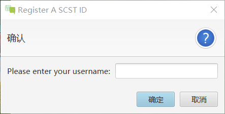

**Hello!**

**SCST-Chat** is a project of simple chat system based on hybrid architecture (P2P + C-S).

## Origin

First of all, it's a comprehensive work assigned in *Computer Network*. It just so happens that the author was recently taking [6.031: Software Construction](https://web.mit.edu/6.031/www/sp21/).

## Function

1. **Basic Chat Functions.** Messages exchanging, file exchanging and registering.
2. **Cryptography Support.** Data transferred was encrypted.
3. **Quick Start.** If users learn about network, they can connect quickly with IP address and ports.

## Feature

1. **Friendly GUI on Client Desktop App.**
2. **Easy to Maintain on Register Server Cmd-line.** 
3. **Strong Scalability.** 
> Here I need to specify. On one hand, the app is based on Java VM so that it can run in various OS allowing JVM. 
>
> On the other hand, through this is a toy app, it has the basic architecture a popular chat app requires. Besides, it is a well-organized **Object-oriented programming**.

## Design

To begin with, let me show you the hybrid architecture.

The pictures below are the exhibition of the GUI.

> **loading screen**
>
> 

>
> **log in**
>
> 

>
> **register**
> 
> 

>
> **quick start**
> 
> 

>
> **chat room**
> 
> 

>

## Quick Start

If you only want to try the P2P chat, you can just clone **SCSTChat-Client** and use its *Quick Start* function. There is also a README.md in it.

If you want to try the entire app, **RegisterServer** and **SCSTChat-Client** are both needed. Read the README.md in it to run the project.

## Improvement

The autor was trying to follow the the goals of the 6.031: **Safe from bugs**, **Easy to understand** and **Ready for change**. However, time and energy not permitting, the project isn't so industrial or commercial. Especially, the autor was almost ignore **Test-first programming**, which is recommanded in the 6.031.

Additionally, the fuctions to extend, the reaction to exception to improve, the interaction to optimize and so on.

## Thanks

Sincere thanks to the develop group members and the professor of *Computer Network*. 

## Last But Not Least

This project is used for studying and reserching. All the materials are from the open Internet with no commercial purpose. 

Simple as the project, the autor still needs to mention that commercial use of **SCST-Chat** is not allowed.
