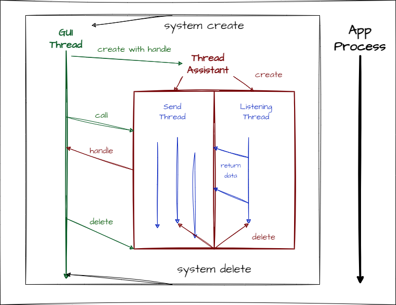

Here is the client desktop application for SCSTChat with GUI, developed by java-1.8. Let's have a quick overview.

```bash
.
├── pom.xml # maven config
├── README.md
├── ReceivedFiles # store received files
│   └── Encrypted # original files are encrypted
└── src
    ├── main
    │   ├── java
    │   │   └── SCSTChat
    │   │       ├── chat
    │   │       │   ├── ClientAssistant.java
    │   │       │   ├── FileSender.java
    │   │       │   ├── MessageHelper.java
    │   │       │   ├── MessageReceiver.java
    │   │       │   ├── MessageSender.java
    │   │       │   └── ServerAssistant.java
    │   │       ├── controller
    │   │       │   ├── ChatRoomViewController.java
    │   │       │   ├── LogInViewController.java # modify to your register ip address
    │   │       │   └── QuickStartViewController.java
    │   │       ├── register # C-S protocol
    │   │       │   ├── RequestForServer.java
    │   │       │   └── ResponseFromServer.java
    │   │       ├── SCSTChatApplication.java # main
    │   │       ├── StartScreen.java
    │   │       ├── utils # tools
    │   │       │   ├── AES.java
    │   │       │   ├── RSA.java
    │   │       │   └── SQLUtil.java
    │   │       └── view
    │   │           ├── ChatRoomView.java
    │   │           ├── LogInView.java
    │   │           └── QuickStartView.java
    │   └── resources
    │       ├── database
    │       │   ├── chatroom.db
    │       │   └── sqlite-jdbc-3.39.4.1.jar # sqlite dependency
    │       ├── images
    │       │   ├── 背景.png
    │       │   ├── 打开文件.png
    │       │   ├── 发送文件.png
    │       │   ├── 发送.png
    │       │   ├── 接收文件.png
    │       │   ├── 左景.png
    │       │   ├── Me.png
    │       │   ├── Peer.png
    │       │   ├── SCSTChat.ico
    │       │   ├── SCSTChat.png
    │       │   └── Welcome.png
    │       └── view # fxml similar to html
    │           ├── css
    │           │   ├── ChatRoomView.css
    │           │   ├── LogInView.css
    │           │   └── QuickStartView.css
    │           ├── ChatRoomView.fxml # design with tools like SenceBuilder
    │           ├── LogInView.fxml
    │           └── QuickStartView.fxml
    └── test # a good project should test first
    
 ```
    
The key of GUI application is how to deal with the relationship between GUI thread and other back threads. Let me show you how SCSTChat-Client works.

<div align=center></div>

You will gain a deeper insight into the JavaFX with SpringBoot through this project. For example, how to create handle (which SpringBoot call "wire") to connect GUI thread with other threads because only GUI thread can change its components.

Last but not least, this project has a reference project: [bluesea-client](https://github.com/cxhqzl/bluesea).